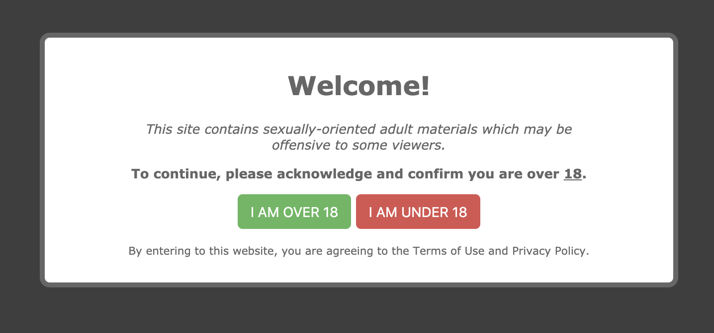

# 1# Open-Source Adult Disclaimer

Need a disclaimer/notice to prevent offensive content? Well, you fount it! 🤗

This **Adult Disclaimer** is a vanilla JavaScript one (which means it doesn't depend from any libraries such as jQuery), and allows you to use it on any websites.

Super lightweight library (just ~4KB), delivered with an elegant, simple and responsive design (adjusts its size depending of the screen resolution).

Under the hood, it uses the client HTML5 browser's *sessionStorage* to remember the user consentement (agreed/disagreed to see the website).




### How to implement it?

Copy the `assets` folder into your project, and add the following in your HTML header (in `<head></head>` section).

```html
<link rel="stylesheet" href="assets/css/disclaimer.css" />
<script src="assets/js/Disclaimer.js"></script>
<script src="assets/js/common.js"></script>
```

That's all! 💪 Enjoy! 😍


### How to change the text on the disclaimer?

Edit `Disclaimer.js` file, and change the values in the `const strings = {}` array located at the top of the file.

For instance, to update the headline from "Welcome!" to "Hi there...", change `welcome: 'Welcome!'` to `welcome: 'Hi there...'`


### Troubleshooting

Any problems or suggestions, please just *Open an Issue* on GitHub 😊
